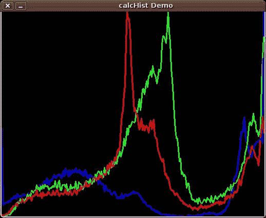

# 图像直方图

> 原文： [https://pythonspot.com/image-histogram/](https://pythonspot.com/image-histogram/)

收集直方图 _ 计数 _ 个数据，这些数据被组织到一组 _bin 中。_ 每个档位都显示频率。 OpenCV 可以为彩色和灰度图像生成直方图。 您可能需要将直方图用于计算机视觉任务。

**Related course:** [Master Computer Vision with OpenCV](https://gum.co/GQWGG)

## Histogram example

Given an image we can generate a histogram for the blue, green and red values.



Histogram Calculation

We use the function cv.CalcHist(image, channel, mask, histSize, range)

参数：

*   图像：应放在方括号中，类型为 uint8 或 float32 的源图像
*   通道：要选择的颜色通道。 用于灰度[0]。 彩色图像具有蓝色，绿色和红色通道
*   遮罩：如果您想要整个图像的直方图，则不适用，否则为一个区域。
*   histSize：箱数
*   范围：颜色范围：

彩色图像的直方图：

```py
# draw histogram in python.
import cv2
import numpy as np

img = cv2.imread('image.jpg')
h = np.zeros((300,256,3))

bins = np.arange(256).reshape(256,1)
color = [ (255,0,0),(0,255,0),(0,0,255) ]

for ch, col in enumerate(color):
    hist_item = cv2.calcHist([img],[ch],None,[256],[0,255])
    cv2.normalize(hist_item,hist_item,0,255,cv2.NORM_MINMAX)
    hist=np.int32(np.around(hist_item))
    pts = np.column_stack((bins,hist))
    cv2.polylines(h,[pts],False,col)

    h=np.flipud(h)

    cv2.imshow('colorhist',h)
    cv2.waitKey(0)

```