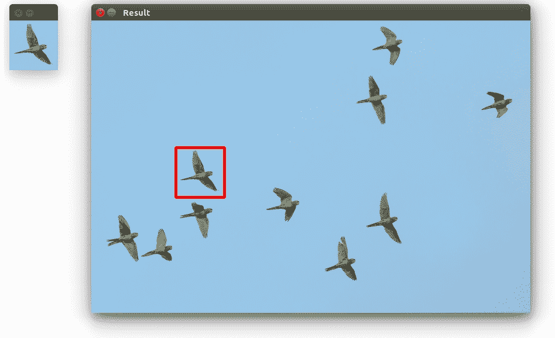
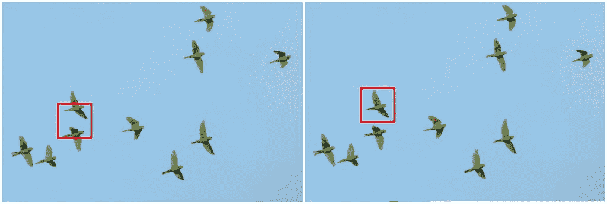

# 使用模板进行对象检测

> 原文： [https://pythonspot.com/object-detection-with-templates/](https://pythonspot.com/object-detection-with-templates/)

**模板匹配**是一种用于查找与补丁（模板）相似的图像区域的技术。
它的应用可以是[机器人](https://pythonspot.com/robotics)或制造业。

## 简介

补丁是具有某些功能的小图像。 模板匹配的目的是在图像中找到补丁/模板。

 

Template matching with OpenCV and Python. Template (left), result image (right)

[下载代码](https://pythonspot.com/download-vision-examples/)

要找到它们，我们都需要：

*   **源图像（S）**：在其中查找匹配项的空间

*   **模板图像（T）**：模板图像

The template image T is slided over the source image S (moved over the source image), and the program tries to find matches using statistics.

## 模板匹配示例

Lets have a look at the code:

```py
import numpy as np
import cv2

image = cv2.imread('photo.jpg')
template = cv2.imread('template.jpg')

# resize images
image = cv2.resize(image, (0,0), fx=0.5, fy=0.5)
template = cv2.resize(template, (0,0), fx=0.5, fy=0.5)

# Convert to grayscale
imageGray = cv2.cvtColor(image, cv2.COLOR_BGR2GRAY)
templateGray = cv2.cvtColor(template, cv2.COLOR_BGR2GRAY)

# Find template
result = cv2.matchTemplate(imageGray,templateGray, cv2.TM_CCOEFF)
min_val, max_val, min_loc, max_loc = cv2.minMaxLoc(result)
top_left = max_loc
h,w = templateGray.shape
bottom_right = (top_left[0] + w, top_left[1] + h)
cv2.rectangle(image,top_left, bottom_right,(0,0,255),4)

# Show result
cv2.imshow("Template", template)
cv2.imshow("Result", image)

cv2.moveWindow("Template", 10, 50);
cv2.moveWindow("Result", 150, 50);

cv2.waitKey(0)

```

## 说明

First we load both the source image and template image with imread().  We resize themand convert them to grayscale for faster detection:

```py

image = cv2.imread('photo.jpg')
template = cv2.imread('template.jpg')
image = cv2.resize(image, (0,0), fx=0.5, fy=0.5)
template = cv2.resize(template, (0,0), fx=0.5, fy=0.5)
imageGray = cv2.cvtColor(image, cv2.COLOR_BGR2GRAY)
templateGray = cv2.cvtColor(template, cv2.COLOR_BGR2GRAY)

```

我们使用 **cv2.matchTemplate** （图像，模板，方法）方法查找图像中最相似的区域。 第三个参数是[统计方法](https://docs.opencv.org/modules/imgproc/doc/object_detection.html?highlight=matchtemplate#matchtemplate)。



Pick the right statistical method for your application. TM_CCOEFF (right), TM_SQDIFF(left)

此方法具有六个匹配方法：CV_TM_SQDIFF，CV_TM_SQDIFF_NORMED，CV_TM_CCORR，CV_TM_CCORR_NORMED，CV_TM_CCOEFF 和 CV_TM_CCOEFF_NORMED。
这是完全不同的[统计比较方法](https://docs.opencv.org/modules/imgproc/doc/object_detection.html?highlight=matchtemplate#matchtemplate)

最后，我们获得矩形变量并显示图像。

## 局限性

Template matching is not scale invariant nor is it rotation invariant. It is a very basic and straightforward method where we find the most correlating area. Thus, this method of object detection depends on the kind of application you want to build. For non scale and rotation changing input, this method works great.

您可能会喜欢：[机器人技术](https://pythonspot.com/robotics)或[具有级联](https://pythonspot.com/car-tracking-with-cascades/)的汽车跟踪。

[下载计算机视觉示例+课程](https://pythonspot.com/download-vision-examples/)