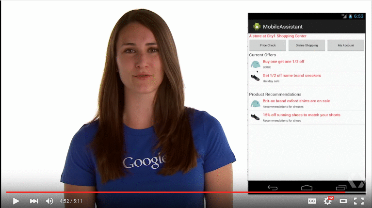

# Python 和 Netflix 点赞图标

> 原文： [https://pythonspot.com/netflix-like-thumbnails-with-python/](https://pythonspot.com/netflix-like-thumbnails-with-python/)

受 [Netflix](https://techblog.netflix.com/2016/03/extracting-image-metadata-at-scale.html) 的启发，我们决定实施对焦点算法。 如果您在移动网站上使用生成的缩略图，则可能会增加 YouTube 视频的点击率（CTR）。
无论如何，这是一个有趣的实验。

## 焦点


所有图像都有一个感兴趣的区域，通常是人或脸。

找到关注区域的算法称为焦点算法。 给定输入图像，将基于关注区域创建一个新图像（缩略图）。



Netflix like Thumbnails Python. Source: Google videos. 

从要用作缩略图的快照图像开始。 我们使用 Haar 功能查找图像中最有趣的区域。 Haar 级联文件可以在以下位置找到：

*   [https://raw.githubusercontent.com/Itseez/opencv/master/data/lbpcascades/lbpcascade_frontalface.xml](https://raw.githubusercontent.com/Itseez/opencv/master/data/lbpcascades/lbpcascade_frontalface.xml)
*   [https://github.com/adamhrv/HaarcascadeVisualizer](https://github.com/adamhrv/HaarcascadeVisualizer)

将这些文件下载到/ data /目录中。

```py

#! /usr/bin/python

import cv2

bodyCascade = cv2.CascadeClassifier('data/haarcascade_mcs_upperbody.xml')
frame = cv2.imread('snapshot.png')
frameHeight, frameWidth, frameChannels = frame.shape
regions = bodyCascade.detectMultiScale(frame, 1.8, 2)
x,y,w,h = regions[0]
cv2.imwrite('thumbnail.png', frame[0:frameHeight,x:x+w])
cv2.rectangle(frame,(x,0),(x+w,frameHeight),(0,255,255),6)
cv2.imshow("Result",frame)
cv2.waitKey(0);

```

我们使用 **cv2.CascadeClassifier（）**加载 haar 级联文件，并使用 **cv2.imread（）**
加载图像，然后 **bodyCascade.detectMultiScale（）** 使用已加载的 Haar 功能检测感兴趣的区域。
使用 **cv2.imwrite（）**将图像另存为缩略图，最后显示图像并用矩形突出显示感兴趣的区域。 运行后，您将获得用于移动网页或应用程序的漂亮缩略图。

如果您还想同时检测身体和面部，可以使用：

```py

#! /usr/bin/python

import cv2

bodyCascade = cv2.CascadeClassifier('data/haarcascade_mcs_upperbody.xml')
faceCascade = cv2.CascadeClassifier('data/lbpcascade_frontalface.xml')
frame = cv2.imread('snapshot2.png')
frameHeight, frameWidth, frameChannels = frame.shape

regions = bodyCascade.detectMultiScale(frame, 1.5, 2)
x,y,w,h = regions[0]
cv2.imwrite('thumbnail.png', frame[0:frameHeight,x:x+w])
cv2.rectangle(frame,(x,0),(x+w,frameHeight),(0,255,255),6)

faceregions = faceCascade.detectMultiScale(frame, 1.5, 2)
x,y,w,h = faceregions[0]
cv2.rectangle(frame,(x,y),(x+w,y+h),(0,255,0),6)

cv2.imshow("Result",frame)
cv2.waitKey(0);
cv2.imwrite('out.png', frame)

```