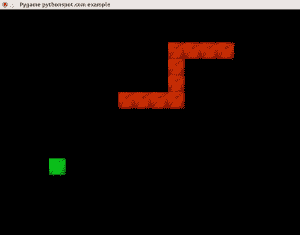
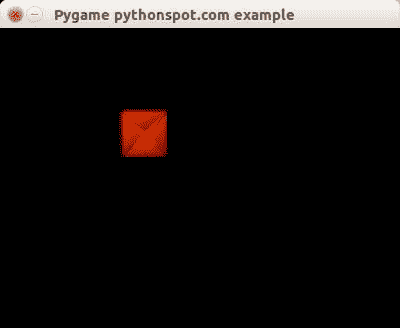

# Pygame 贪食蛇

> 原文： [https://pythonspot.com/snake-with-pygame/](https://pythonspot.com/snake-with-pygame/)



在本教程中，您将学习如何制作[蛇](https://en.wikipedia.org/wiki/Snake_%28video_game%29)游戏。 该游戏是一款街机游戏，逻辑非常简单，这就是为什么它是演示如何使用 Pygame 构建游戏的理想示例的原因。

玩家被表示为蛇，如果它吃了一个苹果，蛇就会成长。 游戏的目的是在不撞到自己的情况下尽可能多地吃苹果。 在游戏的早期阶段这很容易，但是随着蛇的长度增加，难度变得越来越大。

## 入门：基本结构和事件处理。

我们定义了一个 Player 类，它可以保持玩家在屏幕上的位置及其移动的速度。 另外，我们定义 Player 实例可以执行的动作（动作）：

```py
class Player:
    x = 10
    y = 10
    speed = 1

    def moveRight(self):
        self.x = self.x + self.speed

    def moveLeft(self):
        self.x = self.x - self.speed

    def moveUp(self):
        self.y = self.y - self.speed

    def moveDown(self):
        self.y = self.y + self.speed

```

可以使用移动方法创建玩家对象，并可以修改变量。
我们将这些方法链接到事件。 在 Pygame 中，我们可以使用以下代码获得非阻塞式键盘输入：

```py
pygame.event.pump()
keys = pygame.key.get_pressed() 

if (keys[K_RIGHT]):
   print "Right arrow pressed."

```

完整的代码使我们能够在屏幕上移动玩家：

```py
from pygame.locals import *
import pygame

class Player:
    x = 10
    y = 10
    speed = 1

    def moveRight(self):
        self.x = self.x + self.speed

    def moveLeft(self):
        self.x = self.x - self.speed

    def moveUp(self):
        self.y = self.y - self.speed

    def moveDown(self):
        self.y = self.y + self.speed

class App:

    windowWidth = 800
    windowHeight = 600
    player = 0

    def __init__(self):
        self._running = True
        self._display_surf = None
        self._image_surf = None
        self.player = Player() 

    def on_init(self):
        pygame.init()
        self._display_surf = pygame.display.set_mode((self.windowWidth,self.windowHeight), pygame.HWSURFACE)

        pygame.display.set_caption('Pygame pythonspot.com example')
        self._running = True
        self._image_surf = pygame.image.load("pygame.png").convert()

    def on_event(self, event):
        if event.type == QUIT:
            self._running = False

    def on_loop(self):
        pass

    def on_render(self):
        self._display_surf.fill((0,0,0))
        self._display_surf.blit(self._image_surf,(self.player.x,self.player.y))
        pygame.display.flip()

    def on_cleanup(self):
        pygame.quit()

    def on_execute(self):
        if self.on_init() == False:
            self._running = False

        while( self._running ):
            pygame.event.pump()
            keys = pygame.key.get_pressed() 

            if (keys[K_RIGHT]):
                self.player.moveRight()

            if (keys[K_LEFT]):
                self.player.moveLeft()

            if (keys[K_UP]):
                self.player.moveUp()

            if (keys[K_DOWN]):
                self.player.moveDown()

            if (keys[K_ESCAPE]):
                self._running = False

            self.on_loop()
            self.on_render()
        self.on_cleanup()

if __name__ == "__main__" :
    theApp = App()
    theApp.on_execute()

```

现在，您可以使用箭头键在屏幕上移动该块。

<caption id=”attachment_589” align=”alignnone” width=”400”]

pygame example. Move the block around the screen

## 构建玩家（蛇）

玩家控制具有初始长度的蛇。 按下箭头键时，这条蛇总是在移动并改变其移动方向。 为此，更新玩家类：

```py
class Player:
    x = 0
    y = 0
    speed = 32
    direction = 0

    def update(self):
        if self.direction == 0:
            self.x = self.x + self.speed
        if self.direction == 1:
            self.x = self.x - self.speed
        if self.direction == 2:
            self.y = self.y - self.speed
        if self.direction == 3:
            self.y = self.y + self.speed

    def moveRight(self):
        self.direction = 0

    def moveLeft(self):
        self.direction = 1

    def moveUp(self):
        self.direction = 2

    def moveDown(self):
        self.direction = 3

```

并且不要忘记增加游戏循环的延迟。

```py
import time
...
time.sleep (100.0 / 1000.0);

```

它开始更多地起蛇的作用，但是还没有基本长度。 我们跟踪蛇的旧位置并移动蛇的头部。 我们还将绘制方法移到了蛇中。 复制代码，您将得到一条动静的蛇：

```py
from pygame.locals import *
import pygame
import time

class Player:
    x = []
    y = []
    step = 44
    direction = 0
    length = 3

    updateCountMax = 2
    updateCount = 0

    def __init__(self, length):
       self.length = length
       for i in range(0,length):
           self.x.append(0)
           self.y.append(0)

    def update(self):

        self.updateCount = self.updateCount + 1
        if self.updateCount &gt; self.updateCountMax:

            # update previous positions
            for i in range(self.length-1,0,-1):
                print "self.x[" + str(i) + "] = self.x[" + str(i-1) + "]"
                self.x[i] = self.x[i-1]
                self.y[i] = self.y[i-1]

            # update position of head of snake
            if self.direction == 0:
                self.x[0] = self.x[0] + self.step
            if self.direction == 1:
                self.x[0] = self.x[0] - self.step
            if self.direction == 2:
                self.y[0] = self.y[0] - self.step
            if self.direction == 3:
                self.y[0] = self.y[0] + self.step

            self.updateCount = 0

    def moveRight(self):
        self.direction = 0

    def moveLeft(self):
        self.direction = 1

    def moveUp(self):
        self.direction = 2

    def moveDown(self):
        self.direction = 3 

    def draw(self, surface, image):
        for i in range(0,self.length):
            surface.blit(image,(self.x[i],self.y[i])) 

class App:

    windowWidth = 800
    windowHeight = 600
    player = 0

    def __init__(self):
        self._running = True
        self._display_surf = None
        self._image_surf = None
        self.player = Player(10) 

    def on_init(self):
        pygame.init()
        self._display_surf = pygame.display.set_mode((self.windowWidth,self.windowHeight), pygame.HWSURFACE)

        pygame.display.set_caption('Pygame pythonspot.com example')
        self._running = True
        self._image_surf = pygame.image.load("pygame.png").convert()

    def on_event(self, event):
        if event.type == QUIT:
            self._running = False

    def on_loop(self):
        self.player.update()
        pass

    def on_render(self):
        self._display_surf.fill((0,0,0))
        self.player.draw(self._display_surf, self._image_surf)
        pygame.display.flip()

    def on_cleanup(self):
        pygame.quit()

    def on_execute(self):
        if self.on_init() == False:
            self._running = False

        while( self._running ):
            pygame.event.pump()
            keys = pygame.key.get_pressed() 

            if (keys[K_RIGHT]):
                self.player.moveRight()

            if (keys[K_LEFT]):
                self.player.moveLeft()

            if (keys[K_UP]):
                self.player.moveUp()

            if (keys[K_DOWN]):
                self.player.moveDown()

            if (keys[K_ESCAPE]):
                self._running = False
            self.on_loop()
            self.on_render()

            time.sleep (50.0 / 1000.0);
        self.on_cleanup()

if __name__ == "__main__" :
    theApp = App()
    theApp.on_execute()

```

结果：

<caption id=”attachment_594” align=”alignnone” width=”592”]

python snake

## 游戏逻辑

蛇游戏有一些规则：

*   如果蛇吃了一个苹果，那么苹果会移动到新位置。

*   如果蛇吃了一个苹果，蛇的长度就会增加。

*   如果一条蛇自行倒下，请继续游戏。

We start by creating a new class that enables us to create apples:

```py
class Apple:
    x = 0
    y = 0
    step = 44

    def __init__(self,x,y):
        self.x = x * self.step
        self.y = y * self.step

    def draw(self, surface, image):
        surface.blit(image,(self.x, self.y)) 

```

为简单起见，我们将苹果显示为绿色立方体。 我们有这个基本代码，但是除了移动蛇和显示苹果外，它没有做太多的事情：

```py
from pygame.locals import *
import pygame
import time

class Apple:
    x = 0
    y = 0
    step = 44

    def __init__(self,x,y):
        self.x = x * self.step
        self.y = y * self.step

    def draw(self, surface, image):
        surface.blit(image,(self.x, self.y)) 

class Player:
    x = []
    y = []
    step = 44
    direction = 0
    length = 3

    updateCountMax = 2
    updateCount = 0

    def __init__(self, length):
       self.length = length
       for i in range(0,length):
           self.x.append(0)
           self.y.append(0)

    def update(self):

        self.updateCount = self.updateCount + 1
        if self.updateCount > self.updateCountMax:

            # update previous positions
            for i in range(self.length-1,0,-1):
                print "self.x[" + str(i) + "] = self.x[" + str(i-1) + "]"
                self.x[i] = self.x[i-1]
                self.y[i] = self.y[i-1]

            # update position of head of snake
            if self.direction == 0:
                self.x[0] = self.x[0] + self.step
            if self.direction == 1:
                self.x[0] = self.x[0] - self.step
            if self.direction == 2:
                self.y[0] = self.y[0] - self.step
            if self.direction == 3:
                self.y[0] = self.y[0] + self.step

            self.updateCount = 0

    def moveRight(self):
        self.direction = 0

    def moveLeft(self):
        self.direction = 1

    def moveUp(self):
        self.direction = 2

    def moveDown(self):
        self.direction = 3 

    def draw(self, surface, image):
        for i in range(0,self.length):
            surface.blit(image,(self.x[i],self.y[i])) 

class App:

    windowWidth = 800
    windowHeight = 600
    player = 0
    apple = 0

    def __init__(self):
        self._running = True
        self._display_surf = None
        self._image_surf = None
        self._apple_surf = None
        self.player = Player(10) 
        self.apple = Apple(5,5)

    def on_init(self):
        pygame.init()
        self._display_surf = pygame.display.set_mode((self.windowWidth,self.windowHeight), pygame.HWSURFACE)

        pygame.display.set_caption('Pygame pythonspot.com example')
        self._running = True
        self._image_surf = pygame.image.load("pygame.png").convert()
        self._apple_surf = pygame.image.load("apple.png").convert()

    def on_event(self, event):
        if event.type == QUIT:
            self._running = False

    def on_loop(self):
        self.player.update()
        pass

    def on_render(self):
        self._display_surf.fill((0,0,0))
        self.player.draw(self._display_surf, self._image_surf)
        self.apple.draw(self._display_surf, self._apple_surf)
        pygame.display.flip()

    def on_cleanup(self):
        pygame.quit()

    def on_execute(self):
        if self.on_init() == False:
            self._running = False

        while( self._running ):
            pygame.event.pump()
            keys = pygame.key.get_pressed() 

            if (keys[K_RIGHT]):
                self.player.moveRight()

            if (keys[K_LEFT]):
                self.player.moveLeft()

            if (keys[K_UP]):
                self.player.moveUp()

            if (keys[K_DOWN]):
                self.player.moveDown()

            if (keys[K_ESCAPE]):
                self._running = False

            self.on_loop()
            self.on_render()

            time.sleep (50.0 / 1000.0);
        self.on_cleanup()

if __name__ == "__main__" :
    theApp = App()
    theApp.on_execute()

```

因此，我们必须添加游戏逻辑。 要知道蛇的位置是否与苹果的位置匹配，我们必须进行 _ 碰撞检测 _。 这只是意味着要使蛇的坐标与苹果的坐标相交。 我们创建一个新方法来做到这一点：

```py
def isCollision(self,x1,y1,x2,y2,bsize):
    if x1 >= x2 and x1 <= x2 + bsize:
        if y1 >= y2 and y1 <= y2 + bsize:
            return True
    return False

```

给定其块大小 bsize，如果坐标（x1，y1）与（x2，y2）相交，则它将返回 True。 我们调用此方法来确定蛇是否与苹果碰撞。 我们需要检查整个蛇，而不仅是头部，因为我们不希望苹果的新位置位于蛇的某个位置。 我们使用相同的 isCollision 方法来确定蛇是否与自身碰撞（=输掉游戏）。

_ 完整来源：_

```py

from pygame.locals import *
from random import randint
import pygame
import time

class Apple:
    x = 0
    y = 0
    step = 44

    def __init__(self,x,y):
        self.x = x * self.step
        self.y = y * self.step

    def draw(self, surface, image):
        surface.blit(image,(self.x, self.y)) 

class Player:
    x = [0]
    y = [0]
    step = 44
    direction = 0
    length = 3

    updateCountMax = 2
    updateCount = 0

    def __init__(self, length):
       self.length = length
       for i in range(0,2000):
           self.x.append(-100)
           self.y.append(-100)

       # initial positions, no collision.
       self.x[1] = 1*44
       self.x[2] = 2*44

    def update(self):

        self.updateCount = self.updateCount + 1
        if self.updateCount > self.updateCountMax:

            # update previous positions
            for i in range(self.length-1,0,-1):
                self.x[i] = self.x[i-1]
                self.y[i] = self.y[i-1]

            # update position of head of snake
            if self.direction == 0:
                self.x[0] = self.x[0] + self.step
            if self.direction == 1:
                self.x[0] = self.x[0] - self.step
            if self.direction == 2:
                self.y[0] = self.y[0] - self.step
            if self.direction == 3:
                self.y[0] = self.y[0] + self.step

            self.updateCount = 0

    def moveRight(self):
        self.direction = 0

    def moveLeft(self):
        self.direction = 1

    def moveUp(self):
        self.direction = 2

    def moveDown(self):
        self.direction = 3 

    def draw(self, surface, image):
        for i in range(0,self.length):
            surface.blit(image,(self.x[i],self.y[i])) 

class Game:
    def isCollision(self,x1,y1,x2,y2,bsize):
        if x1 >= x2 and x1 <= x2 + bsize:
            if y1 >= y2 and y1 <= y2 + bsize:
                return True
        return False

class App:

    windowWidth = 800
    windowHeight = 600
    player = 0
    apple = 0

    def __init__(self):
        self._running = True
        self._display_surf = None
        self._image_surf = None
        self._apple_surf = None
        self.game = Game()
        self.player = Player(3) 
        self.apple = Apple(5,5)

    def on_init(self):
        pygame.init()
        self._display_surf = pygame.display.set_mode((self.windowWidth,self.windowHeight), pygame.HWSURFACE)

        pygame.display.set_caption('Pygame pythonspot.com example')
        self._running = True
        self._image_surf = pygame.image.load("block.jpg").convert()
        self._apple_surf = pygame.image.load("block.jpg").convert()

    def on_event(self, event):
        if event.type == QUIT:
            self._running = False

    def on_loop(self):
        self.player.update()

        # does snake eat apple?
        for i in range(0,self.player.length):
            if self.game.isCollision(self.apple.x,self.apple.y,self.player.x[i], self.player.y[i],44):
                self.apple.x = randint(2,9) * 44
                self.apple.y = randint(2,9) * 44
                self.player.length = self.player.length + 1

        # does snake collide with itself?
        for i in range(2,self.player.length):
            if self.game.isCollision(self.player.x[0],self.player.y[0],self.player.x[i], self.player.y[i],40):
                print("You lose! Collision: ")
                print("x[0] (" + str(self.player.x[0]) + "," + str(self.player.y[0]) + ")")
                print("x[" + str(i) + "] (" + str(self.player.x[i]) + "," + str(self.player.y[i]) + ")")
                exit(0)

        pass

    def on_render(self):
        self._display_surf.fill((0,0,0))
        self.player.draw(self._display_surf, self._image_surf)
        self.apple.draw(self._display_surf, self._apple_surf)
        pygame.display.flip()

    def on_cleanup(self):
        pygame.quit()

    def on_execute(self):
        if self.on_init() == False:
            self._running = False

        while( self._running ):
            pygame.event.pump()
            keys = pygame.key.get_pressed() 

            if (keys[K_RIGHT]):
                self.player.moveRight()

            if (keys[K_LEFT]):
                self.player.moveLeft()

            if (keys[K_UP]):
                self.player.moveUp()

            if (keys[K_DOWN]):
                self.player.moveDown()

            if (keys[K_ESCAPE]):
                self._running = False

            self.on_loop()
            self.on_render()

            time.sleep (50.0 / 1000.0);
        self.on_cleanup()

if __name__ == "__main__" :
    theApp = App()
    theApp.on_execute()

```

## 结论：


您学习了如何使用 Python 创建游戏蛇以及碰撞检测，图像加载和事件处理等概念。 可以向这个小玩具游戏添加很多东西，但这只是一个非常简单的示例。 :-)

[下一教程](https://pythonspot.com/maze-in-pygame/)