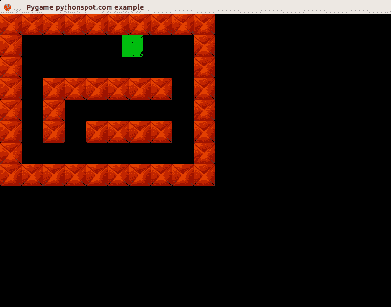

# Pygame 中的迷宫

> 原文： [https://pythonspot.com/maze-in-pygame/](https://pythonspot.com/maze-in-pygame/)

在本教程中，您将学习如何构建迷宫游戏。 这个想法只是用箭头键在迷宫中移动。

## 入门：基本结构和事件处理。

我们定义了一个 Player 类，它可以保持玩家在屏幕上的位置及其移动的速度。 另外，我们定义 Player 实例可以执行的动作（动作）：

```py
class Player:
    x = 10
    y = 10
    speed = 1

    def moveRight(self):
        self.x = self.x + self.speed

    def moveLeft(self):
        self.x = self.x - self.speed

    def moveUp(self):
        self.y = self.y - self.speed

    def moveDown(self):
        self.y = self.y + self.speed

```

可以使用移动方法创建玩家对象，并可以修改变量。 我们将这些方法链接到事件。 在 Pygame 中，我们可以使用以下代码获得非阻塞式键盘输入：

```py
pygame.event.pump()
keys = pygame.key.get_pressed()

if (keys[K_RIGHT]):
    print "Right arrow pressed."

```

The complete code gives us the ability to move the player across the screen:

```py
from pygame.locals import *
import pygame

class Player:
    x = 10
    y = 10
    speed = 1

    def moveRight(self):
        self.x = self.x + self.speed

    def moveLeft(self):
        self.x = self.x - self.speed

    def moveUp(self):
        self.y = self.y - self.speed

    def moveDown(self):
        self.y = self.y + self.speed

class App:

    windowWidth = 800
    windowHeight = 600
    player = 0

    def __init__(self):
        self._running = True
        self._display_surf = None
        self._image_surf = None
        self.player = Player()

    def on_init(self):
        pygame.init()
        self._display_surf = pygame.display.set_mode((self.windowWidth,self.windowHeight), pygame.HWSURFACE)

        pygame.display.set_caption('Pygame pythonspot.com example')
        self._running = True
        self._image_surf = pygame.image.load("pygame.png").convert()

    def on_event(self, event):
        if event.type == QUIT:
            self._running = False

    def on_loop(self):
        pass

    def on_render(self):
        self._display_surf.fill((0,0,0))
        self._display_surf.blit(self._image_surf,(self.player.x,self.player.y))
        pygame.display.flip()

    def on_cleanup(self):
        pygame.quit()

    def on_execute(self):
        if self.on_init() == False:
            self._running = False

        while( self._running ):
            pygame.event.pump()
            keys = pygame.key.get_pressed()

            if (keys[K_RIGHT]):
                self.player.moveRight()

            if (keys[K_LEFT]):
                self.player.moveLeft()

            if (keys[K_UP]):
                self.player.moveUp()

            if (keys[K_DOWN]):
                self.player.moveDown()

            if (keys[K_ESCAPE]):
                self._running = False

            self.on_loop()
            self.on_render()
        self.on_cleanup()

if __name__ == "__main__" :
    theApp = App()
    theApp.on_execute()

```

You can now move the block around the screen with the arrow keys.


pygame

## 创建迷宫


我们定义一个 NxM 矩阵来表示迷宫块的位置。 在此矩阵中，元素 1 表示存在一个块，元素 0 表示不存在。

```py
class Maze:
    def __init__(self):
       self.M = 10
       self.N = 8
       self.maze = [ 1,1,1,1,1,1,1,1,1,1,
                     1,0,0,0,0,0,0,0,0,1,
                     1,0,0,0,0,0,0,0,0,1,
                     1,0,1,1,1,1,1,1,0,1,
                     1,0,1,0,0,0,0,0,0,1,
                     1,0,1,0,1,1,1,1,0,1,
                     1,0,0,0,0,0,0,0,0,1,
                     1,1,1,1,1,1,1,1,1,1,]

```

我们有完整的代码来绘制迷宫：

```py
from pygame.locals import *
import pygame

class Player:
    x = 44
    y = 44
    speed = 1

    def moveRight(self):
        self.x = self.x + self.speed

    def moveLeft(self):
        self.x = self.x - self.speed

    def moveUp(self):
        self.y = self.y - self.speed

    def moveDown(self):
        self.y = self.y + self.speed

class Maze:
    def __init__(self):
       self.M = 10
       self.N = 8
       self.maze = [ 1,1,1,1,1,1,1,1,1,1,
                     1,0,0,0,0,0,0,0,0,1,
                     1,0,0,0,0,0,0,0,0,1,
                     1,0,1,1,1,1,1,1,0,1,
                     1,0,1,0,0,0,0,0,0,1,
                     1,0,1,0,1,1,1,1,0,1,
                     1,0,0,0,0,0,0,0,0,1,
                     1,1,1,1,1,1,1,1,1,1,]

    def draw(self,display_surf,image_surf):
       bx = 0
       by = 0
       for i in range(0,self.M*self.N):
           if self.maze[ bx + (by*self.M) ] == 1:
               display_surf.blit(image_surf,( bx * 44 , by * 44))

           bx = bx + 1
           if bx > self.M-1:
               bx = 0 
               by = by + 1

class App:

    windowWidth = 800
    windowHeight = 600
    player = 0

    def __init__(self):
        self._running = True
        self._display_surf = None
        self._image_surf = None
        self._block_surf = None
        self.player = Player()
        self.maze = Maze()

    def on_init(self):
        pygame.init()
        self._display_surf = pygame.display.set_mode((self.windowWidth,self.windowHeight), pygame.HWSURFACE)

        pygame.display.set_caption('Pygame pythonspot.com example')
        self._running = True
        self._image_surf = pygame.image.load("player.png").convert()
        self._block_surf = pygame.image.load("block.png").convert()

    def on_event(self, event):
        if event.type == QUIT:
            self._running = False

    def on_loop(self):
        pass

    def on_render(self):
        self._display_surf.fill((0,0,0))
        self._display_surf.blit(self._image_surf,(self.player.x,self.player.y))
        self.maze.draw(self._display_surf, self._block_surf)
        pygame.display.flip()

    def on_cleanup(self):
        pygame.quit()

    def on_execute(self):
        if self.on_init() == False:
            self._running = False

        while( self._running ):
            pygame.event.pump()
            keys = pygame.key.get_pressed()

            if (keys[K_RIGHT]):
                self.player.moveRight()

            if (keys[K_LEFT]):
                self.player.moveLeft()

            if (keys[K_UP]):
                self.player.moveUp()

            if (keys[K_DOWN]):
                self.player.moveDown()

            if (keys[K_ESCAPE]):
                self._running = False

            self.on_loop()
            self.on_render()
        self.on_cleanup()

if __name__ == "__main__" :
    theApp = App()
    theApp.on_execute()

```



maze

## 结论

您学习了如何在 Python 中创建 2d 迷宫。 现在，您可能想要添加在上一教程中显示的碰撞检测。 因为我们已经解释了这个概念，所以我们不再赘述：-)

[下一个教程：Pygame 的 AI](/snake-ai-in-pygame/)