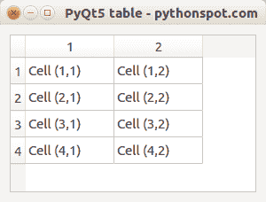

# PyQt5 表

> 原文： [https://pythonspot.com/pyqt5-table/](https://pythonspot.com/pyqt5-table/)

在本文中，您将学习如何将表与 [**PyQt5**](https://pythonspot.com/pyqt5/) 结合使用。 您可以将一个或多个表添加到任何 PyQt 应用程序或窗口。

表可以具有多个行和列。 可以使用 setRowCount（）和 setColumnCount（）来指定。



要添加表，您将需要导入 **QTableWidget** 和 **QTableWidgetItem** 。

## [](#Example "Example")范例

```py
from PyQt5.QtWidgets import QTableWidget,QTableWidgetItem

```

使用以下命令创建一个表：

```py
self.tableWidget = QTableWidget()

# set row count
self.tableWidget.setRowCount(4)

# set column count
self.tableWidget.setColumnCount(2)

```

要添加单个单元格：

```py
self.tableWidget.setItem(X,Y, QTableWidgetItem("TEXT"))

```

## PyQt5 表示例

完整的 [**PyQt5**](https://pythonspot.com/pyqt5/) 表代码如下：

```py
import sys
from PyQt5.QtWidgets import QMainWindow, QApplication, QWidget, QAction, QTableWidget,QTableWidgetItem,QVBoxLayout
from PyQt5.QtGui import QIcon
from PyQt5.QtCore import pyqtSlot

class App(QWidget):

    def __init__(self):
        super().__init__()
        self.title = 'PyQt5 table - pythonspot.com'
        self.left = 0
        self.top = 0
        self.width = 300
        self.height = 200
        self.initUI()

    def initUI(self):
        self.setWindowTitle(self.title)
        self.setGeometry(self.left, self.top, self.width, self.height)

        self.createTable()

        # Add box layout, add table to box layout and add box layout to widget
        self.layout = QVBoxLayout()
        self.layout.addWidget(self.tableWidget) 
        self.setLayout(self.layout) 

        # Show widget
        self.show()

    def createTable(self):
       # Create table
        self.tableWidget = QTableWidget()
        self.tableWidget.setRowCount(4)
        self.tableWidget.setColumnCount(2)
        self.tableWidget.setItem(0,0, QTableWidgetItem("Cell (1,1)"))
        self.tableWidget.setItem(0,1, QTableWidgetItem("Cell (1,2)"))
        self.tableWidget.setItem(1,0, QTableWidgetItem("Cell (2,1)"))
        self.tableWidget.setItem(1,1, QTableWidgetItem("Cell (2,2)"))
        self.tableWidget.setItem(2,0, QTableWidgetItem("Cell (3,1)"))
        self.tableWidget.setItem(2,1, QTableWidgetItem("Cell (3,2)"))
        self.tableWidget.setItem(3,0, QTableWidgetItem("Cell (4,1)"))
        self.tableWidget.setItem(3,1, QTableWidgetItem("Cell (4,2)"))
        self.tableWidget.move(0,0)

        # table selection change
        self.tableWidget.doubleClicked.connect(self.on_click)

    @pyqtSlot()
    def on_click(self):
        print("\n")
        for currentQTableWidgetItem in self.tableWidget.selectedItems():
            print(currentQTableWidgetItem.row(), currentQTableWidgetItem.column(), currentQTableWidgetItem.text())

if __name__ == '__main__':
    app = QApplication(sys.argv)
    ex = App()
    sys.exit(app.exec_())  

```

[下载 PyQT5 示例](https://pythonspot.com/download-pyqt5-examples/)