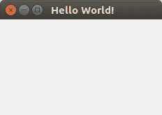

# Qt4 窗口

> 原文： [https://pythonspot.com/qt4-window/](https://pythonspot.com/qt4-window/)

 [PyQt4](https://pythonspot.com/pyqt4/) window on Ubuntu

在本教程中，您将学习如何使用 [PyQT4](https://pythonspot.com/pyqt4/) 创建图形 hello world 应用程序。

[PyQT4](https://pythonspot.com/pyqt4/) ，它是[图形用户界面（GUI）](https://pythonspot.com/gui)编程的 Python 选项之一。

## PyQt4 窗口示例：

This application will create a graphical window that can be minimized, maximimzed and resized it.

```
#! /usr/bin/env python
# -*- coding: utf-8 -*-
#
import sys
from PyQt4.QtGui import *

# Create an PyQT4 application object.
a = QApplication(sys.argv)

# The QWidget widget is the base class of all user interface objects in PyQt4.
w = QWidget()

# Set window size.
w.resize(320, 240)

# Set window title
w.setWindowTitle("Hello World!")

# Show window
w.show()

sys.exit(a.exec_())

```

必须导入 [PyQT4](https://pythonspot.com/pyqt4/) 模块，我们通过以下代码行进行导入：

```
from PyQt4.QtGui import *

```

我们使用 QApplication（）创建 [PyQT4](https://pythonspot.com/pyqt4/) 应用程序对象：

```
a = QApplication(sys.argv)

```

我们创建窗口（QWidget），调整大小，设置标题并显示以下代码：

```
w = QWidget()
w.resize(320, 240)
w.setWindowTitle("Hello World!")

```

不要忘记显示窗口：

```
# Show window
w.show()

```

您可以下载 PyQt4 示例集合： ， [下载 PyQT 代码（批量集合）](https://pythonspot.com/python-qt-examples/)