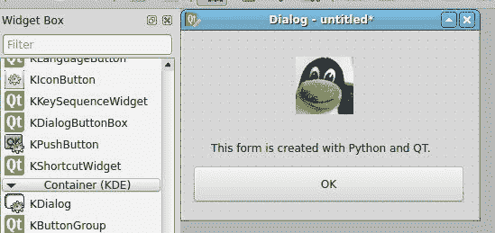
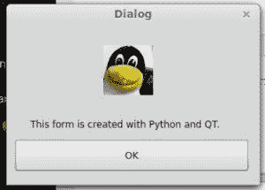
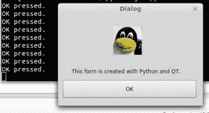

# PyQt4 GUI 教程

> 原文： [https://pythonspot.com/building-an-application-gui-with-pyqt-beginners-tutorial/](https://pythonspot.com/building-an-application-gui-with-pyqt-beginners-tutorial/)

在本教程中，我们将教您如何使用 [PyQT4](https://pythonspot.com/pyqt4/) 创建图形应用程序。 这可以在支持 [PyQT4](https://pythonspot.com/pyqt4/) 的任何平台上使用，包括 Windows，Linux，UNIX，Android，OS X 和 iOS。

## PyQt4 安装

PyQt does not include Qt itself – you may have to obtain it separately. The homepage for PyQt is [https://www.riverbankcomputing.com/software/pyqt/](https://www.riverbankcomputing.com/software/pyqt/).

您将需要安装一些软件包：

```py
sudo pip install pyqt
sudo apt-get install qt4-designer
sudo apt-get install pyqt4-dev-tools
sudo apt-get install python-kde4

```

如果找不到 python-kde4，请更新您的存储库以找到它。 如果您使用的是 Ubuntu，请使用此链接。

## 构建一个 PyQT4 GUI

现在我们可以使用 QT Designer 应用程序。 它使我们不必编写许多 HTML 时可能习惯的布局代码。 从应用程序菜单中启动 qt4-designer。 QT Designer 应用程序将出现。


QT Designer

按不带按钮的对话框，然后按创建。 现在，您可以将任何组件从窗口小部件框拖动到表单。 简单的拖放。 我们添加了一个按钮，标签和一个像素图。 （我从网上拍摄了一张随机图作为像素图）



QT KDE 对话框

我们的窗口如上图所示。 按 Form &gt; Viewcode。 我们将在 C ++中得到一个带有表单代码的弹出框！ 很好，但是我们需要 Python 代码。 按文件&gt;另存为&gt;form.ui。

文件 test.ui 包含以 XML 格式描述的表单。 （您可以在文本编辑器中查看它）打开控制台并键入：

```py
pyuic4 form.ui > form.py

```

运行文件没有任何作用。 创建一个名为 gui.py 的新文件

粘贴以下代码：

```py
import sys
from PyQt4 import QtCore, QtGui
from form import Ui_Dialog

class MyDialog(QtGui.QDialog):
    def __init__(self, parent=None):
        QtGui.QWidget.__init__(self, parent)
        self.ui = Ui_Dialog()
        self.ui.setupUi(self)

if __name__ == "__main__":
    app = QtGui.QApplication(sys.argv)
    myapp = MyDialog()
    myapp.show()
    sys.exit(app.exec_())

```

运行：

```py
python gui.py

```

这将打开我们的图形界面。 按下“确定”按钮将仅关闭该应用程序。



[PyQt](https://pythonspot.com/pyqt4/) 窗口和`QButton`

我们想在按下 OK 按钮时添加一些动作。 我们将以下三行添加到代码中：

```py
self.ui.pushButton.clicked.connect(self.OK)

def OK(self):
    print 'OK pressed.'

```



[pyqt4](https://pythonspot.com/pyqt4/) 应用示例

[下载 PyQT4 示例（批量收集）](https://pythonspot.com/python-qt-examples/)

您可能会喜欢：[使用 PyQT4](https://pythonspot.com/creating-a-webbrowser-with-python-and-pyqt-tutorial/) 或[创建 Web 浏览器 PyQt4 概述](https://pythonspot.com/pyqt4/)