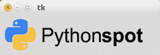

# Tk 小部件

> 原文： [https://pythonspot.com/tk-widgets/](https://pythonspot.com/tk-widgets/)

[Tkinter](https://pythonspot.com/tkinter/) 有几个小部件，包括：

*   标签
*   编辑文字
*   图片
*   按钮（之前讨论过）

在本文中，我们将展示如何使用其中的一些 Tkinter 小部件。 请记住，Python 2.x 和 3.x 的 Tkinter 略有不同

## 标签

要创建标签，我们只需调用 Label（）类并将其打包。 padx 和 pady 是水平和垂直填充。

```py
from Tkinter import *

root = Tk()
root.title('Python Tk Examples @ pythonspot.com')
Label(root, text='Python').pack(pady=20,padx=50)

root.mainloop()

```

## `EditText`（条目小部件）

要获取用户输入，可以使用条目小部件。

```py
from Tkinter import *

root = Tk()
root.title('Python Tk Examples @ pythonspot.com')

var = StringVar()
textbox = Entry(root, textvariable=var)
textbox.focus_set()
textbox.pack(pady=10, padx=10)

root.mainloop()

```

结果：


tk 条目

## 图像

Tk 具有一个小部件来显示图像，即 PhotoImage。 加载图像非常容易：

```py
from Tkinter import *
import os

root = Tk()
img = PhotoImage(file="logo2.png")
panel = Label(root, image = img)
panel.pack(side = "bottom", fill = "both", expand = "yes")
root.mainloop()

```

结果：



python tk 图像

## GUI 编辑器

Tkinter GUI 编辑器的概述可以在这里找到： [http://wiki.tcl.tk/4056](https://wiki.tcl.tk/4056)

[下载 tkinter 示例](/download-tkinter-examples)