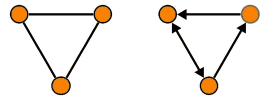

# Python 图

> 原文： [https://pythonspot.com/python-graph/](https://pythonspot.com/python-graph/)

## 介绍

A graph in mathematics and computer science consists of “nodes” which may or may not be connected with one another. Connections between nodes are called edges. A graph can be directed (arrows) or undirected. The edges could represent distance or weight.

default graph (left), directed graph (right)

Python 没有图数据类型。 要使用图，我们可以使用模块，也可以自己实现：

*   自己实现图

*   networkx 模块

## Python 中的图

A directed graph can be defined as:

```py
#!/usr/bin/env python

graph = {'A': ['B', 'C'],
         'B': ['C', 'A'],
         'C': ['D'],
         'D': ['A']}

print(graph)

```

## 使用 networkx 的图

The networkx software module has support for creating, manipulating graphs.

```py
#!/usr/bin/env python
import networkx as nx

G=nx.Graph()
G.add_node("A")
G.add_node("B")
G.add_node("C")
G.add_edge("A","B")
G.add_edge("B","C")
G.add_edge("C","A")

print("Nodes: " + str(G.nodes()))
print("Edges: " + str(G.edges()))

```

结果：

```py
Nodes: [‘A’, ‘C’, ‘B’]
Edges: [(‘A’, ‘C’), (‘A’, ‘B’), (‘C’, ‘B’)]

```