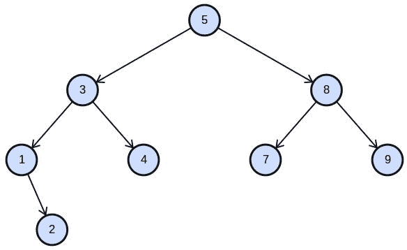

# Python 树

> 原文： [https://pythonspot.com/python-tree](https://pythonspot.com/python-tree)

## 介绍

In computer science, a **tree** is a **data** **structure** that is modeled after nature. Unlike trees in nature, the tree data structure is upside down: the root of the tree is on top. A tree consists of nodes and its connections are called edges. The bottom nodes are also named leaf nodes. A tree may not have a cycle.

A tree with eight nodes. The root of the tree (5) is on top.

Python 没有对树的内置支持。

## Related Course:


*   [Python 编程训练营：从零变成英雄](https://gum.co/dcsp)

## 二叉树

**A binary** **tree** is a data structure where every node has at most two children (left and right child). The **root** of a tree is on top. Every node below has a node above known as the parent node.We define a class thee which has a left and right attribute. From this binary tree we define the root (top of the three) and a left and right node.

```py
#!/usr/bin/env python
class Tree(object):
    def __init__(self):
        self.left = None
        self.right = None
        self.data = None

root = Tree()
root.data = "root"
root.left = Tree()
root.left.data = "left"
root.right = Tree()
root.right.data = "right"

print(root.left.data)

```

然后，您可以像下面这样进一步创建树：

```py
#!/usr/bin/env python
class Tree(object):
    def __init__(self):
        self.left = None
        self.right = None
        self.data = None

root = Tree()
root.data = "root"
root.left = Tree()
root.left.data = "left"
root.right = Tree()
root.right.data = "right"

root.left.left = Tree()
root.left.left.data = "left 2"
root.left.right = Tree()
root.left.right.data = "left-right"

```