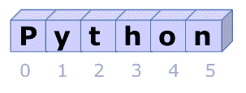

# 字符串（第 2 部分）

> 原文： [https://pythonspot.com/string-slices-part-2/](https://pythonspot.com/string-slices-part-2/)

字符串是一系列字符，它们通常用于显示文本。

要定义字符串，只需在引号之间输入文本。 Python 接受单引号，双引号和三引号。

## 字符串索引

Python 为字符串的字符建立索引，每个索引都与一个唯一字符相关联。 例如，字符串`"python"`中的字符具有索引：

 &lt;/picture&gt;](/wp-content/uploads/2016/03/python-string.png) 

字符串编号

## 字符串中的字符

第 0 个索引用于字符串的第一个字符。 请尝试以下操作：

```py
#!/usr/bin/python

s = "Hello Python"
print(s)      # prints whole string
print(s[0])   # prints "H"
print(s[1]) # prints "e"

```

## 字符串切片

给定字符串`s`，切片的语法为：

```py
s[ startIndex : pastIndex ]

```

startIndex 是字符串的起始索引。 pastIndex 是切片末尾的 1。

如果省略第一个索引，则切片将从头开始。 如果省略最后一个索引，则切片将转到字符串的末尾。 例如：

```py
#!/usr/bin/python

s = "Hello Python"
print(s[0:2]) # prints "He"
print(s[2:4]) # prints "ll"
print(s[6:])  # prints "Python"

```

[下载 Python 练习](https://pythonspot.com/download-python-exercises/)