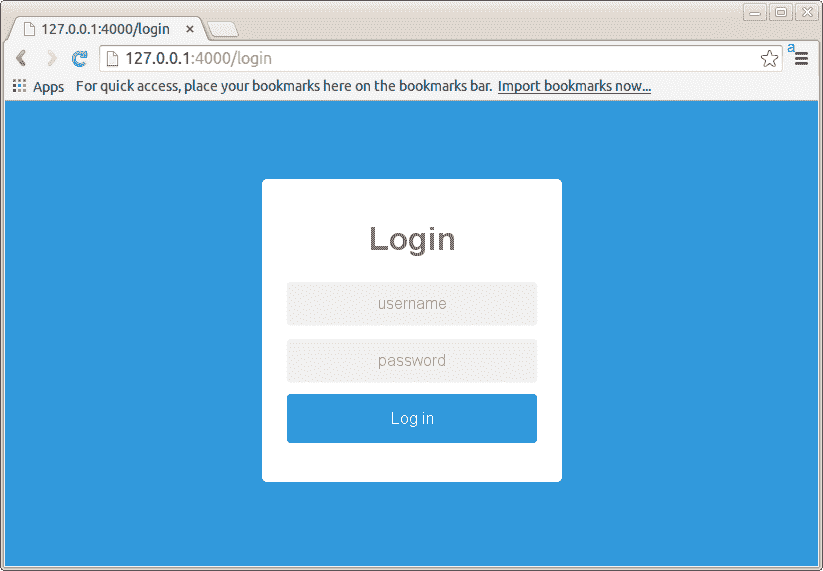

# Flask 和登录验证

> 原文： [https://pythonspot.com/login-authentication-with-flask/](https://pythonspot.com/login-authentication-with-flask/)


Flask 图标

在本教程中，您将学习如何使用 [Flask](https://pythonspot.com/en/python-flask-tutorials/) 和 Python 构建登录 Web 应用程序。

### 建立一个 Flask 登录页面

创建此 Python 文件并将其另存为`app.py`：

```py
from flask import Flask
from flask import Flask, flash, redirect, render_template, request, session, abort
import os

app = Flask(__name__)

@app.route('/')
def home():
if not session.get('logged_in'):
return render_template('login.html')
else:
return "Hello Boss!"

@app.route('/login', methods=['POST'])
def do_admin_login():
if request.form['password'] == 'password' and request.form['username'] == 'admin':
session['logged_in'] = True
else:
flash('wrong password!')
return home()

if __name__ == "__main__":
app.secret_key = os.urandom(12)
app.run(debug=True,host='0.0.0.0', port=4000)

```

在此处创建了两条路由（您可以在浏览器 URL 栏中看到的路径）：

```py
@app.route('/')
@app.route('/login', methods=['POST'])

```

第一个显示基于登录条件的登录屏幕或主屏幕。第二个路由在登录时验证登录变量。

我们创建目录`/templates/`。 使用以下代码创建文件`/templates/login.html`：

```py
;
;

You're logged in already!

;
<form action="/login" method="POST">
  <input type="username" name="username" placeholder="Username">
<input type="password" name="password" placeholder="Password">
<input type="submit" value="Log in">
</form>
;
;
;

```

使用以下命令运行 Web 应用程序：

```py
$ python hello.py

```

在您的网络浏览器中打开 [http://localhost:5000/](http://localhost:5000/) ，然后会出现登录屏幕。 登录凭据显示在`do_admin_login()`函数中。


Pythonspot.com 登录界面

### 使它看起来很棒

功能正常时，登录屏幕看起来像 90 年代初期的用户界面（UI）。 我们从 [codepen.io](https://codepen.io) 中选择了一个随机登录模板。 我们使用文件`style.css`创建目录`/static/`。


```py
* {
box-sizing: border-box;
}

*:focus {
outline: none;
}
body {
font-family: Arial;
background-color: #3498DB;
padding: 50px;
}
.login {
margin: 20px auto;
width: 300px;
}
.login-screen {
background-color: #FFF;
padding: 20px;
border-radius: 5px
}

.app-title {
text-align: center;
color: #777;
}

.login-form {
text-align: center;
}
.control-group {
margin-bottom: 10px;
}

input {
text-align: center;
background-color: #ECF0F1;
border: 2px solid transparent;
border-radius: 3px;
font-size: 16px;
font-weight: 200;
padding: 10px 0;
width: 250px;
transition: border .5s;
}

input:focus {
border: 2px solid #3498DB;
box-shadow: none;
}

.btn {
border: 2px solid transparent;
background: #3498DB;
color: #ffffff;
font-size: 16px;
line-height: 25px;
padding: 10px 0;
text-decoration: none;
text-shadow: none;
border-radius: 3px;
box-shadow: none;
transition: 0.25s;
display: block;
width: 250px;
margin: 0 auto;
}

.btn:hover {
background-color: #2980B9;
}

.login-link {
font-size: 12px;
color: #444;
display: block;
margin-top: 12px;
}

```

将`login.html`模板修改为：

```py
 	 	 	<link rel="stylesheet" href="/static/style.css" type="text/css">
;

<form action="/login" method="POST">
<div class="login">
<div class="login-screen">
<div class="app-title">
<h1>Login</h1>
</div>
<div class="login-form">
<div class="control-group">
				<input type="text" class="login-field" value="" placeholder="username" name="username">
<label class="login-field-icon fui-user" for="login-name"></label></div>
<div class="control-group">
				<input type="password" class="login-field" value="" placeholder="password" name="password">
<label class="login-field-icon fui-lock" for="login-pass"></label></div>
<input type="submit" value="Log in" class="btn btn-primary btn-large btn-block">

</div>
</div>
</div>
</form>
;

```

重新启动应用程序后，将出现以下屏幕：



Python Flask 登录界面

很棒，不是吗？ :-)

### 那么注销呢？

如您所见，没有注销按钮或功能。 创建起来非常容易。 下面提出的解决方案只是众多解决方案之一。 我们创建一个新的路由`/logout`，它直接指向函数`logout()`。 此函数清除会话变量并返回登录屏幕。

```py
@app.route("/logout")
def logout():
session['logged_in'] = False
return home()

```

完整代码：

```py
from flask import Flask
from flask import Flask, flash, redirect, render_template, request, session, abort
import os

app = Flask(__name__)

@app.route('/')
def home():
if not session.get('logged_in'):
return render_template('login.html')
else:
return "Hello Boss!  <a href="/logout">Logout</a>"

@app.route('/login', methods=['POST'])
def do_admin_login():
if request.form['password'] == 'password' and request.form['username'] == 'admin':
session['logged_in'] = True
else:
flash('wrong password!')
return home()

@app.route("/logout")
def logout():
session['logged_in'] = False
return home()

if __name__ == "__main__":
app.secret_key = os.urandom(12)
app.run(debug=True,host='0.0.0.0', port=4000)

```

### 连接数据库

如果要使用多用户登录系统，则应在应用程序中添加一个数据库层。Flask 没有现成的数据库支持。 如果要数据库支持，则必须使用第三方库。 在本教程中，我们将使用 SqlAlchemy。 如果您没有安装，请执行以下操作：

```py
$ sudo pip install Flask-SqlAlchemy

```

SQLAlchemy 是用于 Python 编程语言的 SQL 工具箱和对象关系映射器（ORM）。 它支持 MySQL，Microsoft SQL Server 和许多其他关系数据库管理系统。 如果您不熟悉所有这些术语，请继续阅读。

创建文件`tabledef.py`：

```py
from sqlalchemy import *
from sqlalchemy import create_engine, ForeignKey
from sqlalchemy import Column, Date, Integer, String
from sqlalchemy.ext.declarative import declarative_base
from sqlalchemy.orm import relationship, backref

engine = create_engine('sqlite:///tutorial.db', echo=True)
Base = declarative_base()

########################################################################
class User(Base):
""""""
__tablename__ = "users"

id = Column(Integer, primary_key=True)
username = Column(String)
password = Column(String)

#----------------------------------------------------------------------
def __init__(self, username, password):
""""""
self.username = username
self.password = password

# create tables
Base.metadata.create_all(engine)

```

使用以下命令执行：

```py
python tabledef.py

```

该文件将创建数据库结构。在目录内，您将找到一个名为`tutorial.db`的文件。创建一个名为`dummy.py`的文件，其中将包含以下代码：

```py
import datetime
from sqlalchemy import create_engine
from sqlalchemy.orm import sessionmaker
from tabledef import *

engine = create_engine('sqlite:///tutorial.db', echo=True)

# create a Session
Session = sessionmaker(bind=engine)
session = Session()

user = User("admin","password")
session.add(user)

user = User("python","python")
session.add(user)

user = User("jumpiness","python")
session.add(user)

# commit the record the database
session.commit()

session.commit()

```

执行：

```py
$ python dummy.py

```

这会将伪数据放入数据库中。 最后，我们更新`app.py`

## 使用 SqlAlchemy 验证登录凭据

下一步是编写验证数据库中存在的用户和密码的功能。 使用 SqlAlchemy 我们可以做到这一点（虚拟/伪代码）：

```py
@app.route('/test')
def test():

POST_USERNAME = "python"
POST_PASSWORD = "python"

Session = sessionmaker(bind=engine)
s = Session()
query = s.query(User).filter(User.username.in_([POST_USERNAME]), User.password.in_([POST_PASSWORD]) )
result = query.first()
if result:
return "Object found"
else:
return "Object not found " + POST_USERNAME + " " + POST_PASSWORD

```

我们使用 SqlAlchemys Oject 关系映射（ORM）。 我们将对象映射到关系数据库表，反之亦然。 定义（用户）在`tabledef.py`中给出。`s.query`函数是构建查询的地方。 我们有两个条件：用户名和密码必须匹配。 如果对象存在，`query.first()`返回`true`，否则返回`false`。 这给出了以下总代码：

```py
from flask import Flask
from flask import Flask, flash, redirect, render_template, request, session, abort
import os
from sqlalchemy.orm import sessionmaker
from tabledef import *
engine = create_engine('sqlite:///tutorial.db', echo=True)

app = Flask(__name__)

@app.route('/')
def home():
if not session.get('logged_in'):
return render_template('login.html')
else:
return "Hello Boss!  <a href="/logout">Logout</a>"

@app.route('/login', methods=['POST'])
def do_admin_login():

POST_USERNAME = str(request.form['username'])
POST_PASSWORD = str(request.form['password'])

Session = sessionmaker(bind=engine)
s = Session()
query = s.query(User).filter(User.username.in_([POST_USERNAME]), User.password.in_([POST_PASSWORD]) )
result = query.first()
if result:
session['logged_in'] = True
else:
flash('wrong password!')
return home()

@app.route("/logout")
def logout():
session['logged_in'] = False
return home()

if __name__ == "__main__":
app.secret_key = os.urandom(12)
app.run(debug=True,host='0.0.0.0', port=4000)

```

现在，您可以使用数据库表中定义的任何用户登录。

### 那么安全性呢？

我们在上面演示了一个简单的登录应用程序。 但是，正确保护它是您的工作。 有很多人会尝试闯入您的应用程序。

[下载 Flask 示例](https://pythonspot.com/en/download-flask-examples/)

最佳做法：

*   [散列数据库密码](https://en.wikipedia.org/wiki/Hash_function)。 不要将它们存储为纯文本格式。

*   使用 [HTTPS](https://en.wikipedia.org/wiki/HTTPS) 来保护连接。

*   记录失败的登录尝试。

*   使用验证码可以防止暴力破解登录。

*   其他？ 在评论中写下它们。