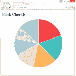
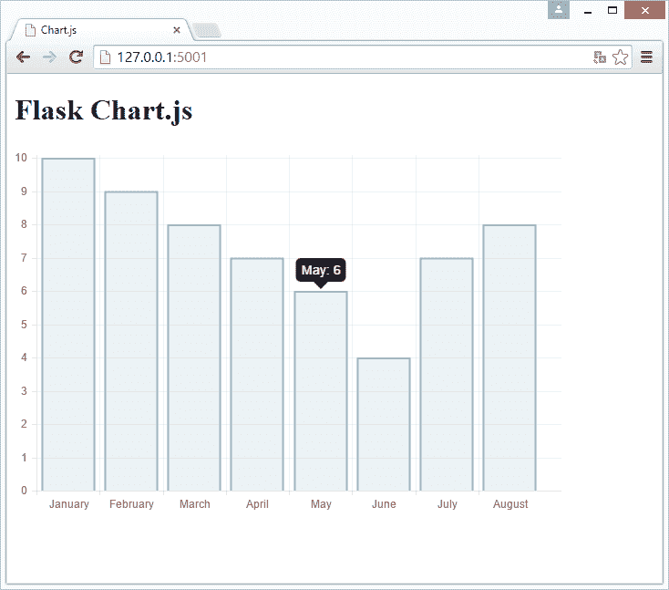
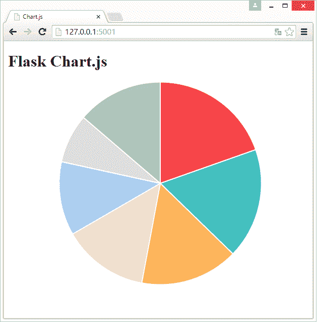

# Flask 和使用 Chart.js 的美观的图表

> 原文： [https://pythonspot.com/flask-and-great-looking-charts-using-chart-js/](https://pythonspot.com/flask-and-great-looking-charts-using-chart-js/)



[**Flask**](/python-flask-tutorials) webapp with pie chart In this article you will learn how to create great looking charts using [Chart.js](http://www.chartjs.org) and [**Flask**](/python-flask-tutorials).

Chart.js is a javascript library to create simple and clean charts. All of them are HTML5 based, responsive, modular, interactive and there are in total 6 charts.

## Related course

[Python Flask: Make Web Apps with Python](https://gum.co/IMzBy)

```py
   <meta charset="utf-8">   <title>Chart.js </title>      <!-- import plugin script -->   <script src="static/Chart.min.js"></script>
<h1>Flask Chart.js</h1>
<!-- bar chart canvas element --><canvas id="chart" width="600" height="400"></canvas>
<script><br />
   // bar chart data<br />
   var barData = {<br />
   labels : [],<br />
   datasets : [<br />
      {<br />
            fillColor: "rgba(151,187,205,0.2)",<br />
            strokeColor: "rgba(151,187,205,1)",<br />
            pointColor: "rgba(151,187,205,1)",<br />
         data : []<br />
      }<br />
      ]<br />
   }</p>
<p>   // get bar chart canvas<br />
   var mychart = document.getElementById("chart").getContext("2d");</p>
<p>   steps = 10<br />
   max = 10<br />
   // draw bar chart<br />
   new Chart(mychart).Bar(barData, {<br />
        scaleOverride: true,<br />
        scaleSteps: steps,<br />
        scaleStepWidth: Math.ceil(max / steps),<br />
        scaleStartValue: 0,<br />
        scaleShowVerticalLines: true,<br />
        scaleShowGridLines : true,<br />
        barShowStroke : true,<br />
        scaleShowLabels: true<br />
   });</p>
<p></script>

```

Create the directory /static/ and add the file [Chart.min.js](https://cdnjs.cloudflare.com/ajax/libs/Chart.js/1.0.2/Chart.min.js) to it. You can get it either from the Chart.js website or use the link. Finally go into the home directory and create app.py with this contents:

```py
from flask import Flask
from flask import Markup
from flask import Flask
from flask import render_template
app = Flask(__name__)

@app.route("/")
def chart():
labels = ["January","February","March","April","May","June","July","August"]
values = [10,9,8,7,6,4,7,8]
return render_template('chart.html', values=values, labels=labels)

if __name__ == "__main__":
app.run(host='0.0.0.0', port=5001)

```

Finally run:

```py
python app.py

```

Open [http://127.0.0.1:5001/](http://127.0.0.1:5001/) and you will see the array values[] plotted with the data in labels[].
We simply pass these two arrays to render_template(). This means that most of the magic occurs in the template. Chart.js is a client-side javascript library which is why our app.py is very minimal.

Result: 

Flask barchart

### 使用 Chart.js 和 Flask 创建折线图

To create a line chart, we can simply modify the chart.html template. Change it to:

```py
<meta charset="utf-8">
<title>Chart.js </title>

<!-- import plugin script -->
<script src="static/Chart.min.js"></script>
<h1>Flask Chart.js</h1>
<!-- bar chart canvas element -->
<canvas id="chart" width="600" height="400"></canvas>

<script></p>
<p>   // bar chart data<br />
   var barData = {<br />
   labels : [],<br />
   datasets : [<br />
      {<br />
            fillColor: "rgba(151,187,205,0.2)",<br />
            strokeColor: "rgba(151,187,205,1)",<br />
            pointColor: "rgba(151,187,205,1)",<br />
            pointStrokeColor: "#fff",<br />
            pointHighlightFill: "#fff",<br />
            pointHighlightStroke: "rgba(151,187,205,1)",<br />
            bezierCurve : false,<br />
            data : []<br />
      }]<br />
   }</p>
<p>    Chart.defaults.global.animationSteps = 50;<br />
    Chart.defaults.global.tooltipYPadding = 16;<br />
    Chart.defaults.global.tooltipCornerRadius = 0;<br />
    Chart.defaults.global.tooltipTitleFontStyle = "normal";<br />
    Chart.defaults.global.tooltipFillColor = "rgba(0,0,0,0.8)";<br />
    Chart.defaults.global.animationEasing = "easeOutBounce";<br />
    Chart.defaults.global.responsive = false;<br />
    Chart.defaults.global.scaleLineColor = "black";<br />
    Chart.defaults.global.scaleFontSize = 16;</p>
<p>   // get bar chart canvas<br />
   var mychart = document.getElementById("chart").getContext("2d");</p>
<p>   steps = 10<br />
   max = 10<br />
   // draw bar chart<br />
   var LineChartDemo = new Chart(mychart).Line(barData, {<br />
        scaleOverride: true,<br />
        scaleSteps: steps,<br />
        scaleStepWidth: Math.ceil(max / steps),<br />
        scaleStartValue: 0,<br />
        scaleShowVerticalLines: true,<br />
        scaleShowGridLines : true,<br />
        barShowStroke : true,<br />
        scaleShowLabels: true,<br />
        bezierCurve: false,</p>
<p>   });</p>
<p></script>

```

输出：

[&lt;picture&gt;&lt;source srcset="/wp-content/uploads/2015/07/linechart.png.webp" type="image/webp"&gt; &lt;source srcset="/wp-content/uploads/2015/07/linechart.png" type="image/jpeg"&gt;  &lt;/picture&gt;](/wp-content/uploads/2015/07/linechart.png) 烧瓶线形图

### 创建饼图

To create a pie chart, we must modify the application code slightly. We need 3 arrays: values, labels and colors. Colors are defined in hexadecimal, as usual in HTML. To iterate them in one loop, we zip them.

```py
from flask import Flask
from flask import Markup
from flask import Flask
from flask import render_template
app = Flask(__name__)

@app.route("/")
def chart():
labels = ["January","February","March","April","May","June","July","August"]
values = [10,9,8,7,6,4,7,8]
colors = [ "#F7464A", "#46BFBD", "#FDB45C", "#FEDCBA","#ABCDEF", "#DDDDDD", "#ABCABC"  ]
return render_template('chart.html', set=zip(values, labels, colors))

if __name__ == "__main__":
app.run(host='0.0.0.0', port=5001)

```

其次，我们将模板修改为：

```py
   <meta charset="utf-8">   <title>Chart.js </title>      <!-- import plugin script -->   <script src="static/Chart.min.js"></script>
<h1>Flask Chart.js</h1>
<!-- bar chart canvas element --><canvas id="chart" width="600" height="400"></canvas>
<script><br />
   var pieData = [<br />
            </p>
<p>         ];</p>
<p>   // get bar chart canvas<br />
   var mychart = document.getElementById("chart").getContext("2d");</p>
<p>   steps = 10<br />
   max = 10<br />
   // draw pie chart<br />
   new Chart(document.getElementById("chart").getContext("2d")).Pie(pieData);</p>
<p></script>

```

结果：

[&lt;picture&gt;&lt;source srcset="/wp-content/uploads/2015/07/flask-piechart.png.webp" type="image/webp"&gt; &lt;source srcset="/wp-content/uploads/2015/07/flask-piechart.png" type="image/jpeg"&gt;  &lt;/picture&gt;](https://pythonspot.com/wp-content/uploads/2015/07/flask-piechart.png) 烧瓶饼图

[下载烧瓶示例](https://pythonspot.com/download-flask-examples/)