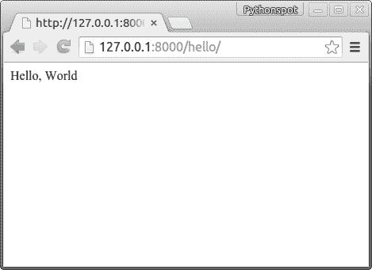

# Django 入门

> 原文： [https://pythonspot.com/django-getting-started/](https://pythonspot.com/django-getting-started/)

Django 是一个高级 Python Web 框架，它处理了很多 Web 开发的麻烦，因此您可以专注于编写应用程序而无需重新发明轮子。

在本教程中，您将学习如何设置基本的 Django Web 应用程序。

## Django 教程

使用以下命令安装 Django：

```py
pip install Django==1.7.1

```

安装后，为您的应用程序创建目录/ django-hello /。 在此目录中，创建具有以下内容的文件 hello.py：

```py
#!/usr/bin/env python
import sys
from django.conf import settings
from django.conf.urls import patterns
from django.http import HttpResponse
from django.core.management import execute_from_command_line

settings.configure(
DEBUG=True,
SECRET_KEY='asecretkey',
ROOT_URLCONF=sys.modules[__name__],
)

def index(request):
return HttpResponse('Hello, World')

urlpatterns = patterns('',
(r'^hello/$', index),
)

if __name__ == "__main__":
execute_from_command_line(sys.argv)

```

使用以下命令执行脚本：

```py
python hello.py runserver

```

HTTP Django 服务器将启动，如果您打开 [http://127.0.0.1:8000/hello/](http://127.0.0.1:8000/hello/)



Django Web 框架

## Django 代码说明：

最上面的行导入 Django 库：

```py
from django.conf import settings
from django.conf.urls import patterns
from django.http import HttpResponse
from django.core.management import execute_from_command_line

```

如果打开链接/ hello /，则网络服务器将调用 index（）函数。 我们使用以下方式将网址映射到函数：

```py
urlpatterns = patterns('',
(r'^hello/$', index),
)

```

在 Django 中，我们提供了网址友好的网址。 这意味着您没有以/ id = 1359835 结尾的 url，而是使用目录作为名称。 最后，我们使用 settings.configure 设置一些默认设置。