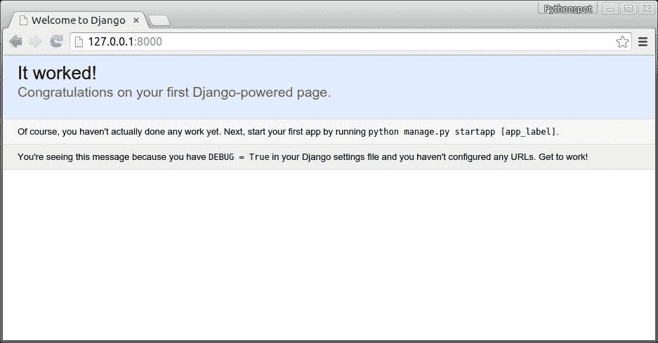
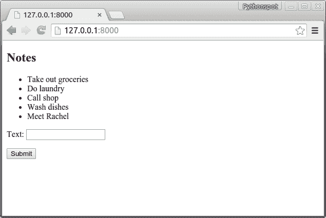
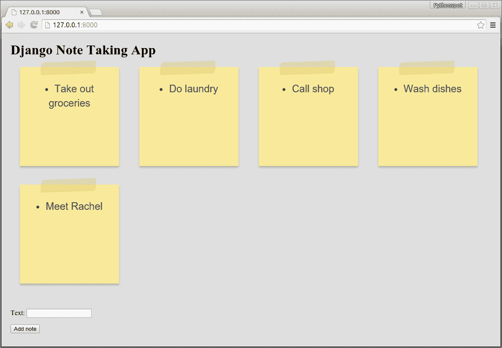

# Django 教程：构建笔记应用程序

> 原文： [https://pythonspot.com/django-tutorial-building-a-note-taking-app/](https://pythonspot.com/django-tutorial-building-a-note-taking-app/)

## Django 的

If you want to start with python web development, you could use a web framework named Django. It is designed to be fast, secure and scalable. It comes with an object-relational mapper (ORM), which means that objects in Python are mapped to objects in a database.

用 Django 创建的应用程序分为三个独立的层：模型（数据库），视图（外观）和控制器（逻辑），或者简称为模型-视图-控制器（MVC）体系结构。

## 设置 Django

Start with:

```py
django-admin startproject mysite
```

This will create the directory mysite. Open mysite/mysite/settings.py. You can configure your desired database here:

```py
1
2
3
4
5
6
7

```

从 sqlite3，postgresql_psycopg2，mysql 或 oracle 中选择。 名称是您的数据库的名称。 如果您使用 SQLite，则会自动创建数据库。 对于 MySQL 和 Postgresql，您需要自己创建数据库。 将一个目录转到/ mysite /并运行：

```py
1
2

```

终端应该说：

```py
1
2
3
4
5
6
7
8
9
10
11
12
13
14

```

在网络浏览器中打开 [http://127.0.0.1:8000](http://127.0.0.1:8000) ，您应该看到：

<caption id=”attachment_1710” align=”alignnone” width=”937”]

Our first Django app.

现在我们创建了一个项目，我们创建了一个应用程序。 一个项目可以有许多应用程序。

```py
python manage.py startapp notes

```

This creates the files:

```py
notes/
    init.py
    admin.py
    migrations/
        init.py
    models.py
    tests.py
    views.py
```

## Django 数据库模型

Change /mysite/notes/models.py to:

```py
1
2
3
4
5
6

```

打开/mysite/mysite/settings.py，添加 Web 应用程序：

```py
1
2
3
4
5
6
7
8
9

```

跑

```py
python manage.py syncdb

```

which will update the database. We then update /mysite/mysite/admin.py to:

```py
1
2
3
4
5
6
7
8
9
10
11

```

跑：

```py
1
2

```

使用以下命令启动服务器：

```py
manage.py runserver

```

Once you open up the admin panel [http://127.0.0.1:8000/admin](http://127.0.0.1:8000/admin), Notes will appear on the page:<caption id=”attachment_1715” align=”alignnone” width=”830”]

Django admin panel

如果单击便笺，则可以查看所有便笺并添加/删除它们：

<caption id=”attachment_1720” align=”alignnone” width=”839”]

Django database admin menu.

## 显示数据

We have all our data in the database, now we want to create our app. Open /mysite/settings.py and add:

```py
1
2
3
4
5
6
7

```

to the bottom of the file. This defines the directory of our templates (html).

Change /mysite/mysite/urls.py to:

```py
1
2
3
4
5
6
7
8
9
10
11

```

Finally create /mysite/static/templates/ and add note.html, which is a simple static html file.

```py
1
2
3
4
5

```

Open [http://127.0.0.1:8000/](http://127.0.0.1:8000/) to test if works. Change note.html to:

```py
1
2
3
4
5

```

Then open /mysite/notes/views.py and change to:

```py
1
2
3
4
5
6
7
8
9
10
11
12
13
14

```

Once you fire up your browser you will see the list of notes:

<caption id=”attachment_1723” align=”alignnone” width=”541”]

django app

## 插入资料

While it’s nice to have a list, we want to add some notes to it.
Create the file /mysite/notes/forms.py

```py
1
2
3
4
5
6
7
8

```

Change view.py to:

```py
1
2
3
4
5
6
7
8
9
10
11
12
13
14
15
16
17
18
19
20

```

Finally we update note.html to:

```py
1
2
3
4
5
6
7
8
9
10
11

```

Run it and we have our note taking app :-)

<caption id=”attachment_1726” align=”alignnone” width=”635”]

Djano note taking app

## 造型应用

By modifying the note.html we can style it like any other html/css website. If you change note.html to:

```py
1
2
3
4
5
6
7
8
9
10
11
12
13
14
15
16

```

You will get:

<caption id=”attachment_1729” align=”alignnone” width=”1189”]

Django note taking app