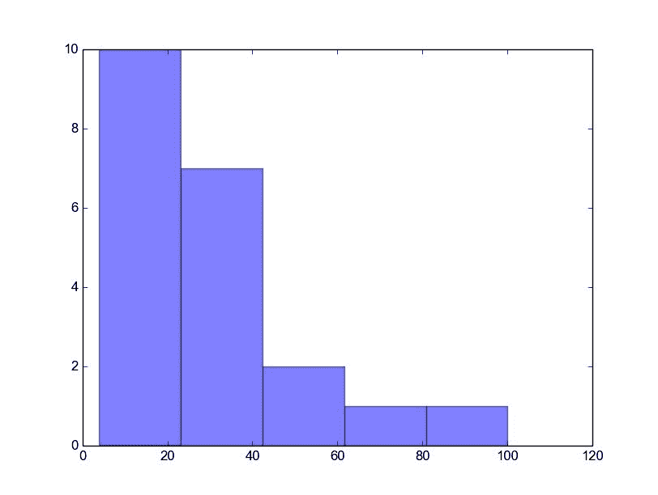
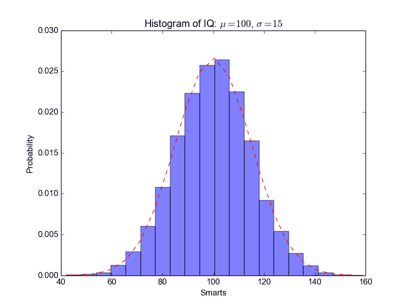

# Matplotlib 直方图

> 原文： [https://pythonspot.com/matplotlib-histogram/](https://pythonspot.com/matplotlib-histogram/)

[**Matplotlib** ](https://pythonspot.com/matplotlib/)可用于创建直方图。 直方图在垂直轴上显示频率，水平轴是另一个维度。 通常它具有箱，其中每个箱具有最小值和最大值。 每个 bin 的频率也介于 x 和无穷大之间。

## Matplotlib 直方图示例

下面显示了最小的 [Matplotlib](https://pythonspot.com/matplotlib/) 直方图：

```py
import numpy as np
import matplotlib.mlab as mlab
import matplotlib.pyplot as plt

x = [21,22,23,4,5,6,77,8,9,10,31,32,33,34,35,36,37,18,49,50,100]
num_bins = 5
n, bins, patches = plt.hist(x, num_bins, facecolor='blue', alpha=0.5)
plt.show()

```

输出：



Python 直方图

## 完整的 matplotlib 直方图

许多东西都可以添加到直方图中，例如拟合线，标签等。 下面的代码创建了更高级的直方图。

```py
#!/usr/bin/env python

import numpy as np
import matplotlib.mlab as mlab
import matplotlib.pyplot as plt

# example data
mu = 100 # mean of distribution
sigma = 15 # standard deviation of distribution
x = mu + sigma * np.random.randn(10000)

num_bins = 20
# the histogram of the data
n, bins, patches = plt.hist(x, num_bins, normed=1, facecolor='blue', alpha=0.5)

# add a 'best fit' line
y = mlab.normpdf(bins, mu, sigma)
plt.plot(bins, y, 'r--')
plt.xlabel('Smarts')
plt.ylabel('Probability')
plt.title(r'Histogram of IQ: $\mu=100$, $\sigma=15$')

# Tweak spacing to prevent clipping of ylabel
plt.subplots_adjust(left=0.15)
plt.show()

```

输出：



Python 直方图

[下载示例](https://pythonspot.com/download-matplotlib-examples/)