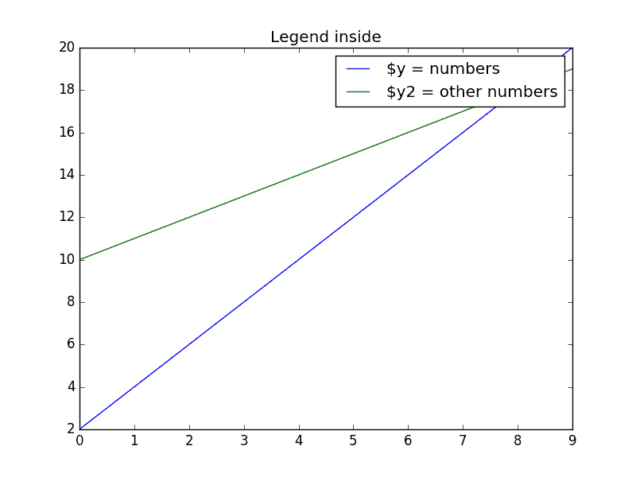
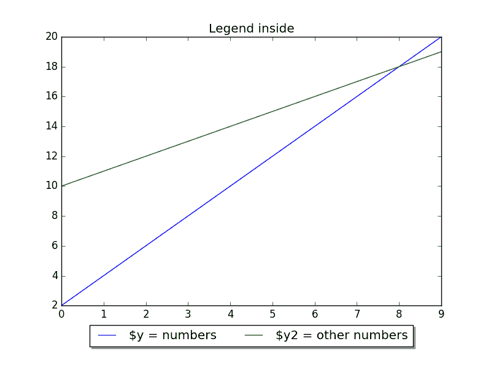
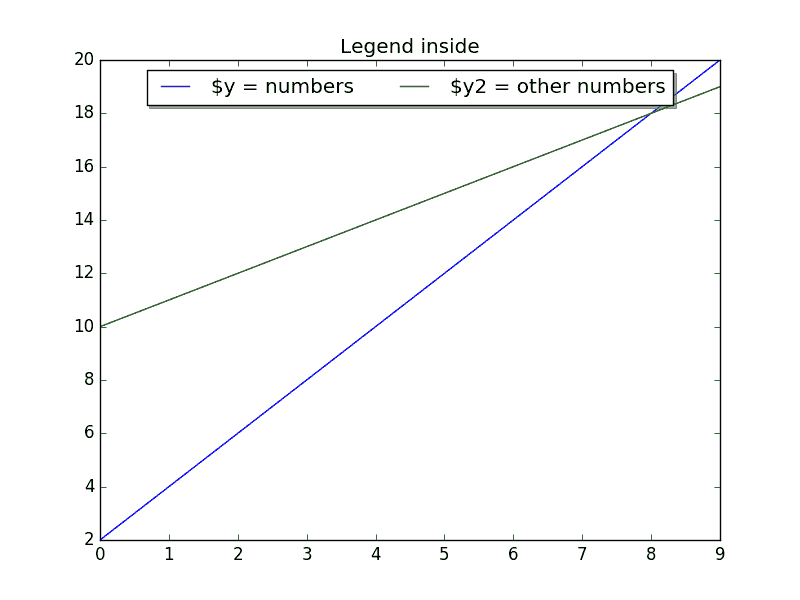
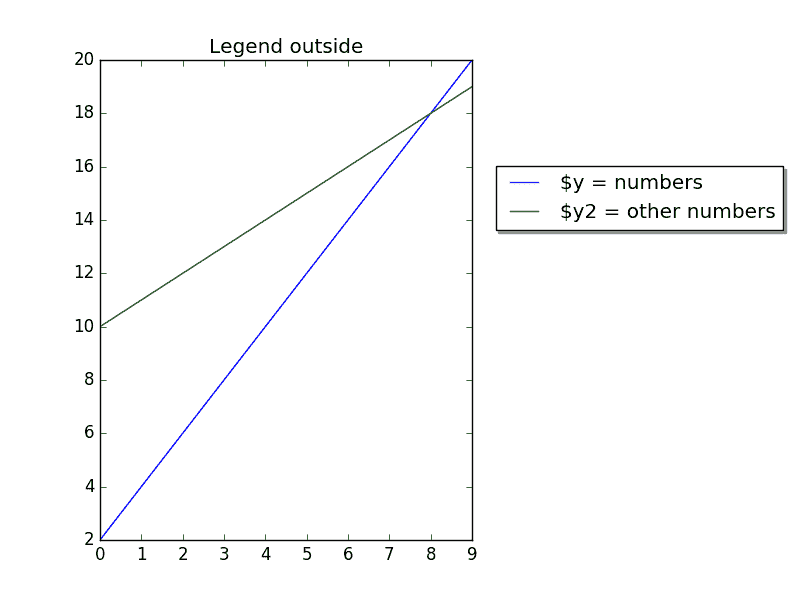

# Matplotlib 图例

> 原文： [https://pythonspot.com/matplotlib-legend/](https://pythonspot.com/matplotlib-legend/)

Matplotlib 对图例具有本机支持。 图例可以放置在各个位置：图例可以放置在图表的内部或外部，并且可以移动位置。

legend（）方法将图例添加到绘图中。 在本文中，我们将向您展示一些使用 matplotlib 的图例示例。

## Matplotlib 图例位于

中，要将图例放置在其中，只需调用 legend（）：

```py

import matplotlib.pyplot as plt
import numpy as np

y = [2,4,6,8,10,12,14,16,18,20]
y2 = [10,11,12,13,14,15,16,17,18,19]
x = np.arange(10)
fig = plt.figure()
ax = plt.subplot(111)
ax.plot(x, y, label='$y = numbers')
ax.plot(x, y2, label='$y2 = other numbers')
plt.title('Legend inside')
ax.legend()
plt.show()

```



[Matplotlib](https://pythonspot.com/matplotlib/) legend inside

## Matplotlib 图例位于底部

要将图例置于底部，请将 legend（）调用更改为：

```py

ax.legend(loc='upper center', bbox_to_anchor=(0.5, -0.05),&nbsp; shadow=True, ncol=2)

```

考虑到我们设置了列数 _ncol = 2_ 并设置了阴影。

完整的代码为：

```py

import matplotlib.pyplot as plt
import numpy as np

y = [2,4,6,8,10,12,14,16,18,20]
y2 = [10,11,12,13,14,15,16,17,18,19]
x = np.arange(10)
fig = plt.figure()
ax = plt.subplot(111)
ax.plot(x, y, label='$y = numbers')
ax.plot(x, y2, label='$y2 = other numbers')
plt.title('Legend inside')
ax.legend(loc='upper center', bbox_to_anchor=(0.5, -0.05),&nbsp; shadow=True, ncol=2)
plt.show()

```



Legend placed on bottom

## Matplotlib 图例在顶部

要将图例放在顶部，请更改 bbox_to_anchor 值：

```py

ax.legend(loc='upper center', bbox_to_anchor=(0.5, 1.00),&nbsp; shadow=True, ncol=2)

```

码：

```py

import matplotlib.pyplot as plt
import numpy as np

y = [2,4,6,8,10,12,14,16,18,20]
y2 = [10,11,12,13,14,15,16,17,18,19]
x = np.arange(10)
fig = plt.figure()
ax = plt.subplot(111)
ax.plot(x, y, label='$y = numbers')
ax.plot(x, y2, label='$y2 = other numbers')
plt.title('Legend inside')
ax.legend(loc='upper center', bbox_to_anchor=(0.5, 1.00), shadow=True, ncol=2)
plt.show()

```



Legend on top

## 右图例之外的

我们可以通过调整框的大小并相对于图例放置图例来放置图例 ouside：

```py

chartBox = ax.get_position()
ax.set_position([chartBox.x0, chartBox.y0, chartBox.width*0.6, chartBox.height])
ax.legend(loc='upper center', bbox_to_anchor=(1.45, 0.8), shadow=True, ncol=1)

```

码：

```py

import matplotlib.pyplot as plt
import numpy as np

y = [2,4,6,8,10,12,14,16,18,20]
y2 = [10,11,12,13,14,15,16,17,18,19]
x = np.arange(10)
fig = plt.figure()
ax = plt.subplot(111)
ax.plot(x, y, label='$y = numbers')
ax.plot(x, y2, label='$y2 = other numbers')
plt.title('Legend outside')
chartBox = ax.get_position()
ax.set_position([chartBox.x0, chartBox.y0, chartBox.width*0.6, chartBox.height])
ax.legend(loc='upper center', bbox_to_anchor=(1.45, 0.8), shadow=True, ncol=1)
plt.show()

```



[Matplotlib](https://pythonspot.com/matplotlib/) legend outside

[下载示例](https://pythonspot.com/download-matplotlib-examples/)