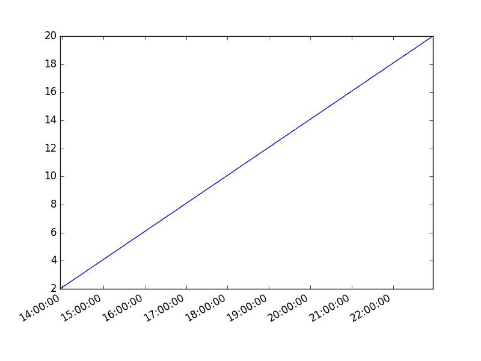

# 使用 matplotlib 绘制时间

> 原文： [https://pythonspot.com/plot-time-with-matplotlib/](https://pythonspot.com/plot-time-with-matplotlib/)

Matplotlib 支持在水平（x）轴上带有时间的图。 数据值将放在垂直（y）轴上。 在本文中，我们将通过一些示例进行演示。

需要使用 Python datetime 模块（标准模块）。

## 绘制时间

您可以使用时间戳绘制时间：

```py

import matplotlib
import matplotlib.pyplot as plt
import numpy as np
import datetime

# create data
y = [ 2,4,6,8,10,12,14,16,18,20 ]
x = [datetime.datetime.now() + datetime.timedelta(hours=i) for i in range(len(y))]

# plot
plt.plot(x,y)
plt.gcf().autofmt_xdate()
plt.show()

```

[&lt;picture&gt;&lt;source srcset="/wp-content/uploads/2016/07/matplotilb-time-1.png.webp" type="image/webp"&gt; &lt;source srcset="/wp-content/uploads/2016/07/matplotilb-time-1.png" type="image/jpeg"&gt; &lt;/picture&gt; ](/wp-content/uploads/2016/07/matplotilb-time-1.png)

如果要更改间隔，请使用以下几行之一：

```py

# minutes
x = [datetime.datetime.now() + datetime.timedelta(minutes=i) for i in range(len(y))]

```

## 从特定小时/分钟开始的时间图


要从特定日期开始，请使用 datetime.datetime（年，月，日，小时，分钟）创建新的时间戳。
完整示例：

```py

import matplotlib
import matplotlib.pyplot as plt
import numpy as np
import datetime

# create data
customdate = datetime.datetime(2016, 1, 1, 13, 30)
y = [ 2,4,6,8,10,12,14,16,18,20 ]
x = [customdate + datetime.timedelta(hours=i) for i in range(len(y))]

# plot
plt.plot(x,y)
plt.gcf().autofmt_xdate()
plt.show()

```

[下载示例](https://pythonspot.com/download-matplotlib-examples/)