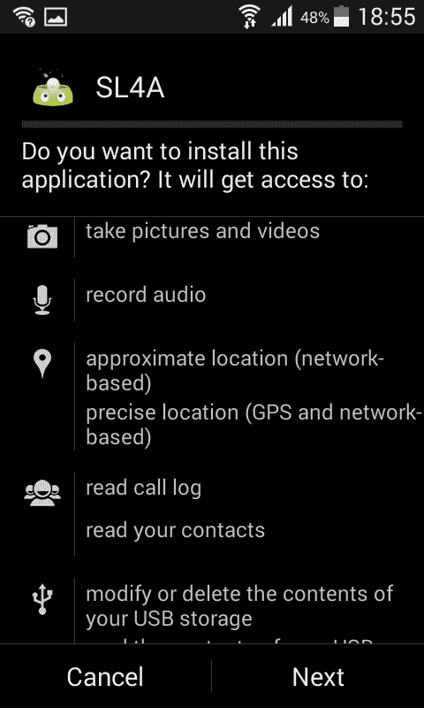

# SL4A：Android Python 脚本

> 原文： [https://pythonspot.com/sl4a-android-python-scripting/](https://pythonspot.com/sl4a-android-python-scripting/)

可以使用 **Android 脚本层（SL4A）**和适用于 Android 的 **Python 解释器，在 Android 上运行 Python 脚本。**

## SL4A

SL4A 项目使在 Android 上编写脚本成为可能，它支持许多编程语言，包括 Python，Perl，Lua，BeanShell，JavaScript，JRuby 和 Shell。 _SL4A 项目有很多 Google 的贡献者，但它不是 Google 的正式项目。_

脚本可以访问 Android 特定的功能，例如呼叫，短信（SMS），拍照，文字转语音，蓝牙等等。

在本文中，您将学习如何**使用 SL4A 在 Android 设备上运行 Python。**

#### SL4A 专为开发人员设计

Keep in mind that SL4A is designed for developers and in alpha quality software.

## 安装 SL4A


QR: Link to SL4A APK

First enable installation of programs from unknown sources. By default Android devices can only install apps from the Google Play Store.

You have to enable the permission ‘Install from Unknown Sources’, by going to **Settings -> Security -> Unknown Sources** and tap the box.

After you have have updated these settings donwload the SL4A APK. Visit [https://github.com/kuri65536/sl4a](https://github.com/kuri65536/sl4a "https://github.com/kuri65536/sl4a") on your Android device and download the SL4A APK (or use the QR code on the right).
Once downloaded an installation menu will popup, requesting all permissions on your Android device.



SL4A-Permissions

## 安装适用于 Android 的 Python 3


QR Code Python 3 for Android

Install the **Py4A app.** The Python for Android app is built to run solely on

Android devices. You should use this app together with SL4A.

You can pick any version of Py4A, but bare in mind the supported version on Android:

*   Python 2 需要 Android 设备&gt; = 1.6

*   Python 3 需要 Android 设备&gt; = 2.3.1

The git repository is: [https://github.com/kuri65536/python-for-android/releases](https://github.com/kuri65536/python-for-android/releases "https://github.com/kuri65536/python-for-android/releases")

You could also use the QR code on the right using a QR scanner on your Android device.

Once Py4A is installed, start the app and press install. This will install the Python interpreter.


Android Python 3 Install

## SL4A

Open SL4A again. Many scripts will appear (in a list). You can now run Python scripts on your Android Device!


Python-On-Android

Press on a program such as speak.py A little popup will be shown. Pressing on the terminal icon will start the Python script.


SL4A-Python-Menu

The third button (the pencil) will open an editor. This is not a full blown IDE but a simple editor.
It doesn’t have syntax highlighting.

## 在 Android 上编写脚本

You may prefer your favorite Python editor whatever it may be (vim/emacs fans here? PyCharm? Atom?)
All scripts are stored in /sl4a/scripts/

#### 注意：文件扩展名

If you installed the Python 3 interpreter, the programs will show with a .py3 extension instead of a .py extension.

一个简单的程序（太空飞船发射）：

```py

"""TTS Rocket Launch."""

__author__ = 'Frank <[email protected]>'

import android

droid = android.Android()
message = "Python on Android"
droid.ttsSpeak(message)

for i in range(10,0,-1):
    droid.ttsSpeak(str(i))

droid.ttsSpeak("We have lift off!")
droid.ttsSpeak("rrrrrr")

```

更多示例：
[http://www.mattcutts.com/blog/android-barcode-scanner/](http://www.mattcutts.com/blog/android-barcode-scanner/ "http://www.mattcutts.com/blog/android-barcode-scanner/")
[https://github.com/damonkohler/sl4a/blob/ wiki / Tutorials.md](https://github.com/damonkohler/sl4a/blob/wiki/Tutorials.md "SL4A")